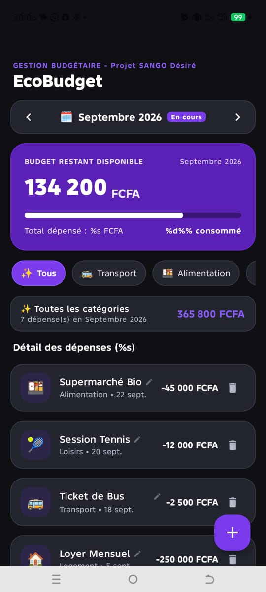

# EcoBudget 🌿
# EcoBudget est une application de gestion budgétaire développée 
# en Kotlin Multiplatform (KMP) dans le cadre de notre formation 
# en Master 2 genie logiciel. Ce projet vise à mutualiser la logique métier,
# les modèles de données et les ressources au sein d'un module partagé (shared),
# tout en migrant les dépendances Android natives vers des solutions 
# multiplateformes comme Compose Multiplatform et kotlinx-datetime.

# Process d''implementation du projet devma-2025-2026':

# 1- clonage du projet (devma 2025-2026-projet Ecobudget) depuis le dépot git
# 2 - Création du module shared : via new-module-java or kotlin librairy
# 3-suppression du contenu 'build.gradle.kts' et synchronisation ...
# 4-Suppression du dossier Main du module 'shared'
# Ajout des plugins et dependencies nécessaires au module 'shared'dans le fichier build.gradle.kts"

# Création du dossier commonMain/kotlin, androidMain/kotlin ,iosMain/kotlin"
# Liaison des modules 'shared' et 'app' via :   implementation(project(":shared"))
# synchronisation du fichier build.gradle.kts après ajout de   implementation(project(":shared"))
# Nettoyage : suppression de  implementation(libs.kotlinx.coroutines.core) et synchronisation ...

# migration des données (modèles et données) vers le module 'shared')
# migration des couches de ddonnées et presentation (layers) vers le module 'shared'
# Centralisation des ressources textuelles
    

# Difficultés rencontrées et Corrections apportées: 

#  1- Géneration d'exceptions (erreurs ) lors de la synchronisation du projet après mise à jour de build.gradle.kts.
# problème dû à la position du bloc android dans le fichier build.gradle.kts . 
# Correction 1- retirer le bloc android du bloc kotlin

# 2 - problème de migration direct du  modèle category  du fait de la dependance android
# Correction 2 - integrer compose multiplateform
# 3 -erreur dans le modèle Category suite à son transfert (Res) vers commonMain.
# Correction 3- ajout de 'import ecobudget.shared.generated.resources.*'  et fixage de Res dans 'compose.resources'
# 4-erreur dans le modèle YearMonth  suite à son transfert (Res) vers commonMain dûes au format de date (calendar).
# Correction 4 - adapter les fonctions dates d'android aux fonctions de date de kotlin"

# 5- erreur dans le FakeTransactionRepository suite à son transfert data.Repository vers commonMain, dûes aux dates 
# Correction 5 - Les imports java.util.Calendar et java.util.UUID ont été  supprimés et adapter selon le modele YearMonth
# 6 -erreurs de compatibilité de class java (date...),après migration des données vers commonMain.
# Correction 6- Remplacer les imports java.util...par  kotlinx.datetime , le calcul de la date (Java) et l'UUID par id = generateId(),
# 7 - Erreurs sanq les fichiers du dossier UI-COMPONENTS (AddTransactionDialog.kt , MonthNavigatorBar.kt , TransactionCard.kt):
#  Correction 7 -remplacement dans les 3 fichiers ; R.string par Res.string

## Conclusion / Build

Capture de l'application après compilation et exécution sur émulateur Android :

  

